# Documento di Progetto

- **Autore:** Giovanni Colombo
- **Matricola:** 02451A
- **Anno Accademico:** 2022/2023
- **Corso:** Programmazione Web e Mobile

## Indice

1. [Getting Started](#getting-started)
    - [Prerequisites](#prerequisites)
    - [Setup Instructions](#setup-instructions)
    - [.env.example](#envexample)
2. [Presentazione dell'Applicazione](#presentazione-dellapplicazione)
    - [Login / Register](#login--register)
    - [Home](#home)
    - [Search](#search)
    - [Profile](#profile)
    - [Settings](#settings)
    - [Playlist](#playlist)
3. [Organizzazione del Codice](#organizzazione-del-codice)
    - controllers
    - database
    - middlewares
    - public
    - routes
    - services
    - utils
    - views
        - partials
    - *server.js*
4. [Scelte Implementative e Parti rilevanti di codice](#scelte-implementative-e-parti-rilevanti-di-codice)
    - [Autenticazione e Autorizzazione (Cookies & JWT)](#autenticazione-e-autorizzazione-cookies--jwt)
    - [Middleware](#middleware) 
        - [isAuthenticated](#isauthenticated)
        - [ownershipVerifier](#ownershipverifier)
    - [Gestione delle Pagine (EJS e Partials)](#gestione-delle-pagine-ejs-e-partials)
    - [Chiamate Spotify API](#chiamate-spotify-api)
    - [Filtraggio e Ristrutturazione Dati Spotify](#filtraggio-e-ristrutturazione-dati-spotify)
    - [Debounce: Ricerca e Selezione Generi](#debounce-ricerca-e-selezione-generi)
    - [Database](#database)
        - [Connessione al Database](#connessione-al-database)
        - [Salvataggio Password](#salvataggio-password)
    - [Gestione Immagini Utenti](#gestione-immagini-utenti)
        - [Fase 1: Caricamento dei File con Multer](#fase-1-caricamento-dei-file-con-multer)
        - [Fase 2: Elaborazione e Memorizzazione dell'Immagine](#fase-2-elaborazione-e-memorizzazione-dellimmagine)
5. [Lavori Futuri](#lavori-futuri)

## Getting Started

### Prerequisites

- Node.js installed
- MongoDB account
- Spotify Developer account

### Setup Instructions

Follow the steps below to get this application up and running.

1. Clone the Repository: 
```bash
git clone https://github.com/GioooTDM/snm.git
```
2. Navigate to the Directory: 
```bash
cd snm
```
3. Install Dependencies: 
```bash
npm install
```
4. Set Environment Variables:
Create a `.env` file in the root directory and populate it with the necessary keys and values. You can refer to the [`.env.example`](#envexample) file for guidance.
5. Run the Project: 
```bash
npm start
```

### .env.example

```env
# MongoDB Configuration
DB_URI="your_mongodb_uri_here"

# Spotify API Configuration
CLIENT_ID="your_spotify_client_id_here"
CLIENT_SECRET="your_spotify_client_secret_here"

# JWT Secret
JWT_SECRET="your_jwt_secret_here"

#Port
PORT=80
```

## Presentazione dell'Applicazione

### Login / Register

- Controlli effettuati: 
    - Nessun campo deve essere vuoto
    - L'indirizzo Email deve essere univoco
    - Le password devono corrispondere

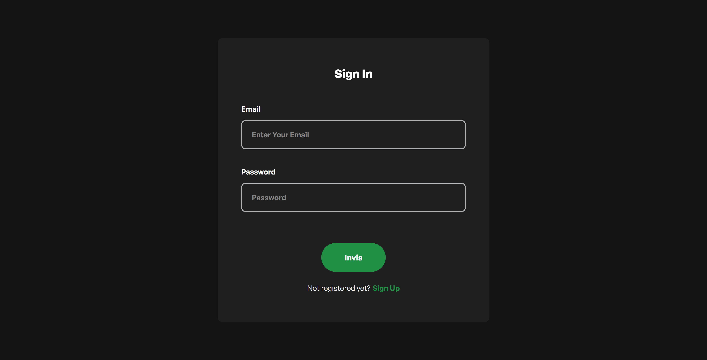
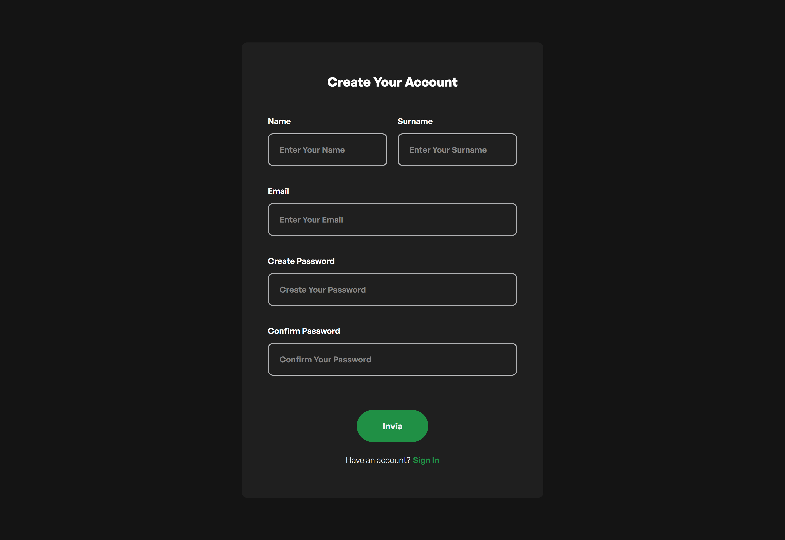

### Home

- Visualizzazione delle canzoni più popolari a livello globale *(con la possibilità di aggiungerle alle proprie playlists)*
- Visualizzazione degli artisti più popolari a livello globale *(con la possibilità di mettere like)*
- Visualizzazione delle ultime uscite (sia singoli che album)


### Search

#### Search: Songs

- Ricerca canzoni, con possibilità di mettere like o di aggiungerle alle playlist

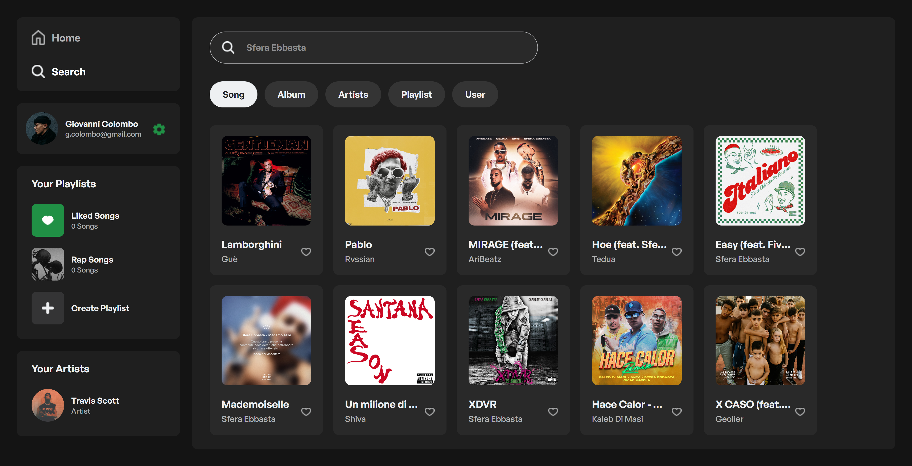

#### Search: Albums

- Ricerca album musicali

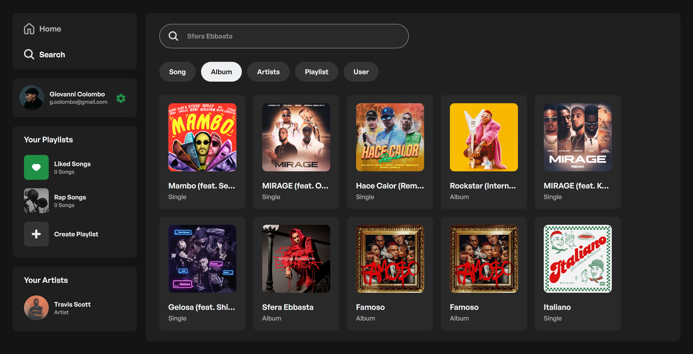

#### Search: Artists

- Ricerca artisti con possibilità di mettere like; verranno visualizzati nella libreria

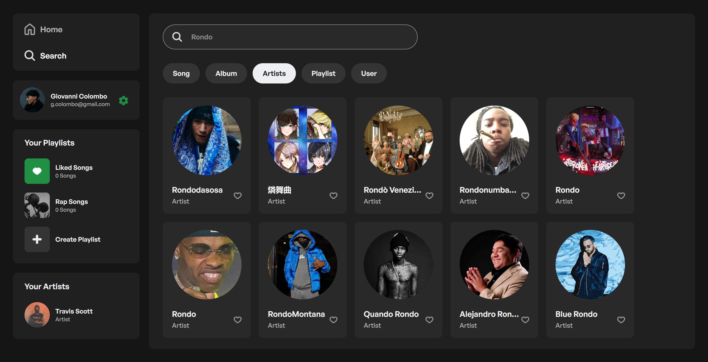

#### Search: Playlists

- Ricerca tra tutte le playilist **pubbliche**. La ricerca si può effettuare per:
    - Nome della playlist
    - Tags della playlist (ogni tags deve iniziare con il carattere #)

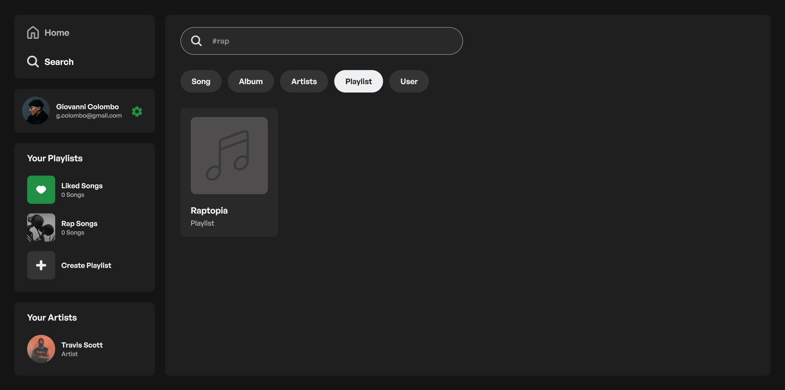

#### Search: Users

- Ricerca fra tutti gli utenti del social network. La ricerca si può effettuare per:
    - Nome
    - Cognome
    - Nome e Cognome
    - Indirizzo Mail

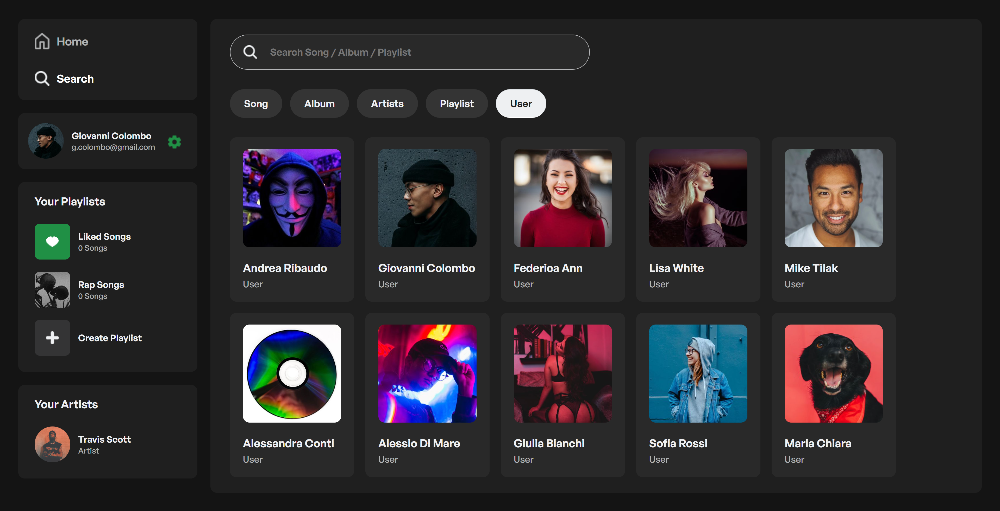

### Profile

Funzionalità:
- Possibilità di cambiare la propria immagine porfilo
- Visualizzazione delle proprie playlist (sia pubbliche sia private)
- Visualizzazione delle playlist a cui si è messo like
- Possibilità di effettuare il logout


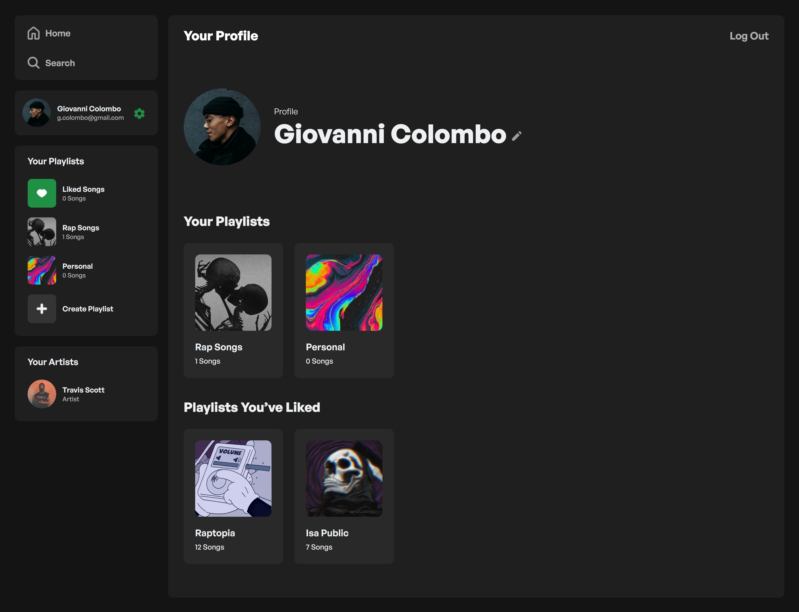


### Settings

Funzionalità:
- Modifica Nome / Cognome
- Modifica Indirizzo Mail
- Modifica Password
- Eliminazione Account
- Selezione generi musicali preferiti

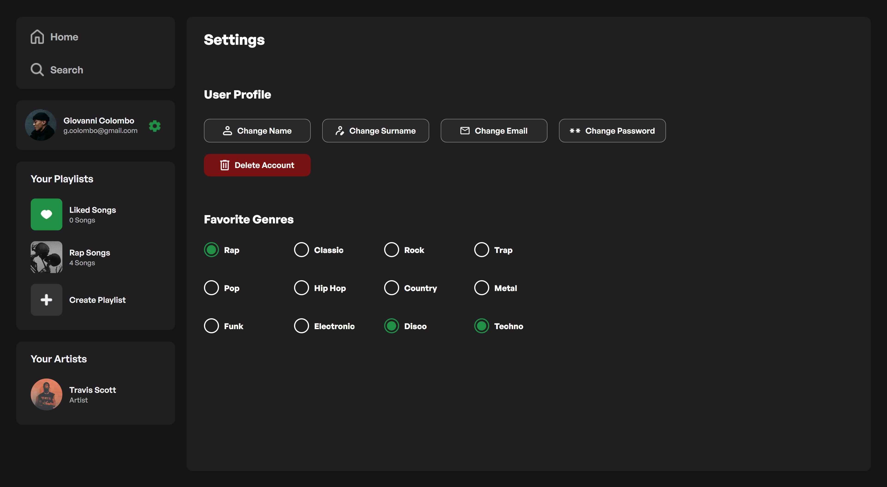

### Library

- **Liked Songs**: raccolta delle canzoni a cui l'utente ha messo mi piace.
- **Your Playlists**: raccolta delle playlist create dall'utente.
- **Create Playlist**: crea una nuova playlist (titolo obbligatorio, descrizione opzionale).
- **Your Artists**: raccolta degli artisti a cui l'utente ha messo mi piace.

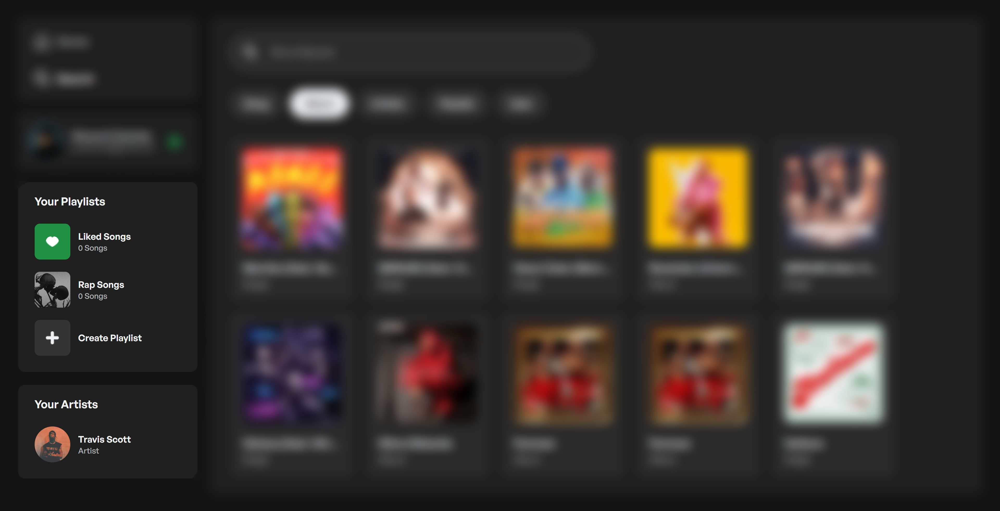

### Playlist 

- **Prospettiva Prorietario (IMG 1):**
    - Modifica Nome 
    - Modifica Tags
    - Modifica Descrizione
    - Modifica Stato (Pubblico / Privato)
    - Aggiunta e Rimozione Canzoni 
    - Eliminazione Playlist
- **Prospettiva Visitatore (IMG 2):**
    - Like alla Playlist
    - Scorciatoia per aggiungere le canzoni alle proprie playlist

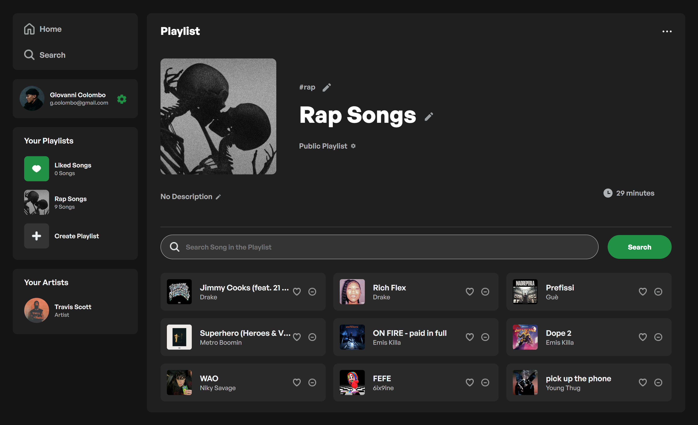
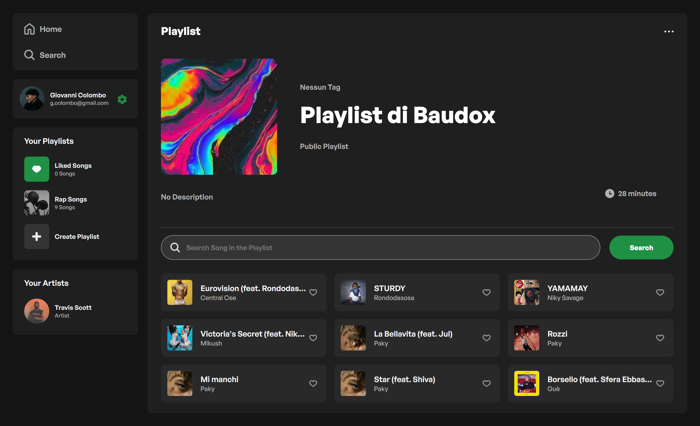

## Organizzazione del codice

- `controllers`: contiene i controller che gestiscono la logica dell'applicazione. Ogni controller è responsabile per una specifica parte dell'app, come l'autenticazione, la gestione delle pagine, delle playlist, della ricerca e degli utenti.
- `database`: contiene i file che gestiscono la connessione con il database.
- `middlewares`: contiene tutti i middleware personalizzati utilizzati nel progetto.
- `public`: contiene tutti i file statici come CSS, Immagini e JavaScript front-end. Sono i file che saranno accessibili direttamente dai client.
- `routes`: contiene i file che definiscono le rotte dell'applicazione.
- `services`: contiene i servizi che interagiscono con il database e altre API. Ogni servizio è specializzato in un particolare tipo di operazione, come la gestione delle playlist o delle interazioni con l'API di Spotify.
- `utils`:  contiene utility e helper che possono essere utilizzati in tutto il progetto. Ad esempio, funzioni per effettuare chiamate API o per mappare dati.
- `views`: contiene i file delle view che definiscono la UI dell'applicazione. Utilizza il motore di template EJS per la generazione dinamica del contenuto.
    - `partials`:  contiene pezzi di codice riutilizzabili o "parziali" delle view, come intestazioni, piè di pagina, barre laterali e altri componenti comuni.
- `server.js`: file di entry point dell'applicazione. Inizializza il server, configura i middleware, e imposta le rotte.

## Scelte Implementative e Parti rilevanti di codice

### Autenticazione e Autorizzazione (Cookies & JWT)

L'autenticazione è gestita attraverso l'uso di JSON Web Tokens (JWT). Quando un utente si registra o effettua il login, un token JWT viene generato e inviato al client come cookie HTTP-only. Questo meccanismo aumenta la sicurezza, impedendo l'accesso al token da parte di script client-side. Il token viene poi utilizzato per autenticare le richieste successive dell'utente.

```js
// Creazione del token JWT
const token = jwt.sign({ id: user._id }, process.env.JWT_SECRET, {
expiresIn: '48h'  
});
  
// Imposta il JWT in un cookie httpOnly
res.cookie('auth_token', token, {
    httpOnly: true,
    maxAge: 1000 * 60 * 60 * 48 // 48 ore
});
```

### Middleware

#### isAuthenticated

Il middleware `isAuthenticated` ha il compito di verificare se la richiesta HTTP contiene un JWT valido. Questo viene fatto cercando il token all'interno del cookie denominato `auth_token`. Se il cookie è presente e il JWT è valido, l'ID dell'utente viene estratto dal token e aggiunto all'oggetto `req` come `req.userId`, permettendo ai middleware o ai route handler successivi di utilizzare questa informazione. 
Se il token è invalido o scaduto, reindirizza l'utente all'endpoint `/login`.

#### ownershipVerifier

Il middleware `ownershipVerifier` è progettato per assicurare che solo il legittimo proprietario di una playlist possa modificarla. 

Confronta l'ID del creatore della playlist (`playlist.createdBy`) con l'ID dell'utente autenticato (`req.userId`), impostato dal middleware isAuthenticated.

Se gli ID coincidono, l'utente è il legittimo proprietario della playlist. La richiesta viene inoltrata al middleware o al route handler successivo per ulteriori elaborazioni.

In caso contrario, cioè se gli ID non coincidono, il middleware interrompe immediatamente la richiesta e risponde con uno status HTTP 403 (Vietato). Questa risposta informa il client che l'utente non ha i diritti necessari per modificare la playlist in questione.

### Gestione delle Pagine (EJS e Partials)

Il progetto fa uso di Embedded JavaScript (EJS) come motore di templating per facilitare la creazione di pagine HTML dinamiche. EJS offre un meccanismo flessibile per iniettare dati variabili direttamente nel codice HTML, permettendo così di personalizzare l'interfaccia utente in base al contesto.

```ejs
    <div>
        <h5>
            <%= user.name + " " + user.surname %>
        </h5>
        <p>
            <%= user.email %>
        </p>
    </div>
```

Un punto di forza di EJS è la sua capacità di utilizzare i "partials", che sono frammenti di codice HTML riutilizzabili. Questa funzionalità è particolarmente utile per elementi che compaiono in più pagine del sito, come l'header, la barra di navigazione laterale e finestre modali. L'utilizzo dei partials rende il codice più pulito e manutenibile, semplificando anche l'aggiornamento degli elementi comuni su tutte le pagine, poiché le modifiche a un partial si riflettono automaticamente su tutte le pagine che lo includono.

```ejs
    <%- include('partials/you.ejs') %>
```

Grazie a questa combinazione di EJS e partials, il progetto raggiunge un alto livello di modularità, facilitando sia lo sviluppo che la manutenzione.

### Chiamate Spotify API

Il progetto sfrutta le API di Spotify per acquisire dati come tracce musicali, album e artisti. La maggior parte delle chiamate all'API di Spotify sono coordinate tramite il modulo `spotifyService`. Questo modulo, a sua volta, si appoggia su un modulo di utility, `fetchWrapper`, che si occupa della gestione del token di accesso per autenticare le richieste.

#### Gestione del Token di Accesso

Un aspetto critico dell'interazione con le API di Spotify è la scadenza del token di accesso. Ogni token ha una vita limitata e deve essere rinnovato una volta scaduto. Il modulo fetchWrapper si occupa di questa problematica in due modi:

1. **Memorizzazione del Token e della sua Scadenza:** Quando un token viene ottenuto, viene memorizzato insieme al suo timestamp di scadenza. Questo consente di sapere quando il token diventerà inutilizzabile.

```js
let token = null;
let tokenExpiration = null;
```

2. **Verifica della Validità del Token:** Prima di ogni chiamata API, il modulo verifica se il token corrente è ancora valido. Se il token è scaduto o non esiste, ne richiede uno nuovo.

```js
if (!token || Date.now() > tokenExpiration) {
    await fetchToken();
}
```

Grazie a questa architettura, la logica di autenticazione e rinnovo del token è incapsulata all'interno del modulo `fetchWrapper` rendendo il codice più pulito.

### Filtraggio e Ristrutturazione Dati Spotify

In molti casi, quando lavoriamo con le API esterne come quella di Spotify, otteniamo un grande set di dati che contiene più campi di quelli effettivamente necessari per la nostra applicazione. Per migliorare la leggibilità e la coerenza del codice, è utile filtrare questi dati per conservare solo i campi che ci interessano. Per far ciò ho creato il file `spotifyDataMapper.js` che contiene tre funzioni:

- `filterTrackFields`
- `filterAlbumFields`
- `filterArtistFields` 

Ognuna di queste funzioni prende come input un oggetto JSON proveniente dall'API di Spotify e restituisce un nuovo oggetto con solo i campi desiderati.

```js
exports.filterArtistFields = (item) => {
    return {
        name: item.name,
        id: item.id,
        genres: item.genres,
        popularity: item.popularity,
        image: item.images[0] ? item.images[0].url : null
    };
}
```

### Debounce: Ricerca e Selezione Generi

La funzione `debounce` è un componente chiave per migliorare le prestazioni e l'efficienza dell'applicazione. Essa viene impiegata specificamente per due aspetti fondamentali del sito: 
- la funzionalità di ricerca
- la selezione dei generi musicali preferiti dall'utente.

**Obiettivi della funzione**

L'implementazione della funzione mira a:

- Minimizzare il numero di richieste inviate all'API di Spotify, principalmente durante le operazioni di ricerca
- Allegerire il carico sul server, facilitando sia la ricerca che la selezione dei generi musicali.

**Dettagli Tecnici**

Il principio alla base della funzione `debounce` è quello di posticipare l'esecuzione di una specifica funzione fino a quando non sia trascorso un determinato intervallo di tempo (`delay`) dalla sua ultima invocazione. 
Il codice sottostante è un'implementazione esemplare:

```js
// File: utils.js

export function debounce(func, delay) {
    let debounceTimer;
    return function () {
        const context = this;
        const args = arguments;
        clearTimeout(debounceTimer);
        debounceTimer = setTimeout(() => func.apply(context, args), delay);
    };
```

**Ricerca Musicale**

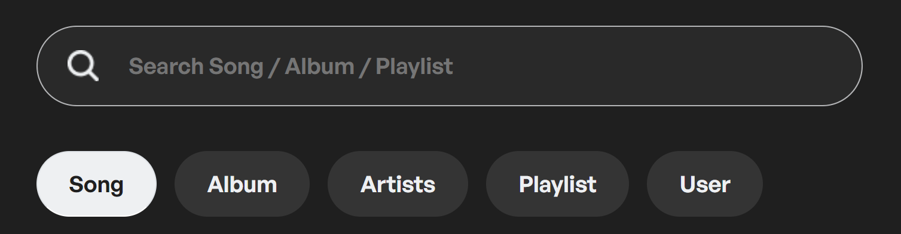

Nella ricerca, senza la funzione `debounce`, un'invocazione dell'API di Spotify verrebbe fatta ogni volta che l'utente preme un tasto. Questo comporterebbe un numero eccessivo di richieste in rapida successione. Invece, con `debounce` applicato, una richiesta all'API viene effettuata solo se non sono stati premuti altri tasti per almeno 300 ms.

**Selezione di Generi Musicali**

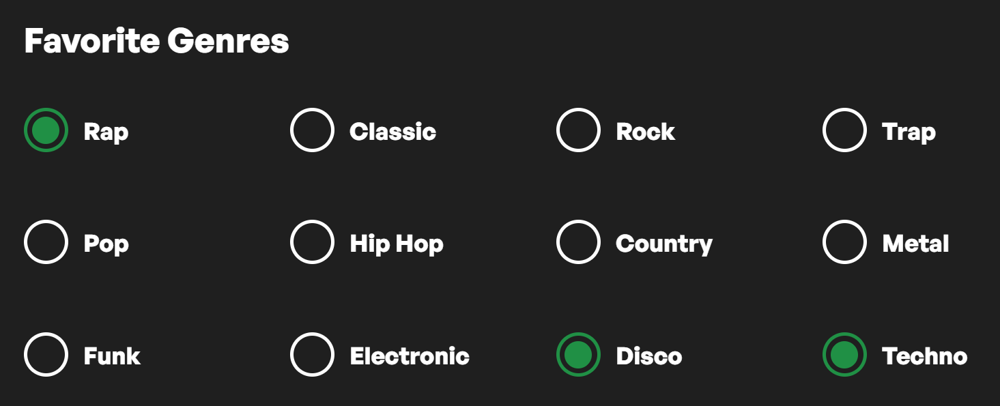

Un'altra applicazione della funzione `debounce` è nella selezione dei generi musicali preferiti da parte dell'utente. Anche in questo caso, l'utilizzo di `debounce` assicura che le modifiche apportate alle preferenze di genere siano aggregate e inviate come un'unica richiesta, piuttosto che come una serie di richieste separate.

**TLTR:**

- Riduzione del carico sul server
- Miglioramento delle prestazioni e dell'esperienza utente
- Ottimizzazione dei costi associati al numero di richieste API

### Database 

#### Connessione al Database

La logica di connessione è incapsulata nel modulo `connection.js`, che sfrutta il driver ufficiale `mongodb` per interagire con MongoDB. Invece di stabilire connessioni multiple, il progetto conserva e riutilizza una singola connessione per evitare overhead inutile e migliorare le prestazioni.

Il modulo `connection.js` esporta due elementi principali: 
- `connectToDatabase()`: una funzione asincrona che inizia la connessione al database.
- `client`: l'istanza di MongoClient

Nel file principale `server.js`, viene invocata la funzione `connectToDatabase()` per stabilire una connessione al database all'avvio dell'applicazione. 

#### Salvataggio Password

La protezione delle informazioni degli utenti è di primaria importanza. Pertanto, prima di procedere con la memorizzazione nel database, ogni password viene criptata (hashing). Questo passo assicura che, in caso di violazioni, le informazioni sensibili rimangano inaccessibili e protette.

```js
const salt = await bcrypt.genSalt();
const hashedPassword = await bcrypt.hash(password, salt);
```

- *Salt:* Prima di procedere all'hashing, viene generato un "salt", che è essenzialmente una stringa casuale. Questo salt viene combinato con la password dell'utente per creare l'hash. Questo passo è fondamentale per prevenire attacchi con dizionario e attacchi di tipo rainbow table, che sono tecniche utilizzate per decifrare gli hash. Ogni utente avrà un salt unico, il che significa che due utenti con la stessa password avranno hash diversi nel database.

- *Hashing:* Dopo aver generato il salt, la password viene effettivamente hashata combinandola con il salt. L'hash risultante viene poi salvato nel database, al posto della password in chiaro.

Durante il processo di login, la password fornita dall'utente viene nuovamente hashata usando il salt associato (già integrato nell'hash originale presente nel database). Se questo nuovo hash coincide con quello precedentemente salvato, l'accesso viene autorizzato.

*Esempio di password hashata:*

```
$2b$10$b63K/D03WFBktWy552L5XuibmiD5SxCrKg9kHCqOYaZwxRjIg14u2

$2b$ 10$ b63K/D03WFBktWy552L5Xu ibmiD5SxCrKg9kHCqOYaZwxRjIg14u2

60 caratteri totali
```
- **\$2b$**: indica la versione dell'algoritmo bcrypt utilizzato
- **10$**: denota l'esponente utilizzato per calcolare il numero di iterazioni (2^n)
- **Successivi 22 caratteri**: rappresentano il salt
- **Successivi 31 caratteri**: costituiscono l'hash vero e proprio.

### Gestione Immagini Utenti

Il meccanismo di salvataggio delle Immagini Profilo di ogni utente si divide in due step: la fase di upload del file e l'elaborazione dell'immagine.

#### Fase 1: Caricamento dei File con Multer

Prima di elaborare le foto degli utenti e salvarle nel DB, è essenziale garantire che il caricamento del file stesso sia gestito in modo efficace.

Per questo motivo ho utilizzato **Multer**, un middleware progettato specificamente per gestire il caricamento di file. La sua specializzazione nel trattamento di `multipart/form-data` rende particolarmente adatto per gestire le operazioni di caricamento di file nelle applicazioni web, come l'upload delle immagini profilo nel nostro caso.

Nel progetto, Multer è stato configurato per accettare file con una dimensione massima di 10MB. Questa configurazione assicura che gli utenti non possano sovraccaricare il server con file di dimensioni eccessive. 

```js
const upload = multer({
  limits: {
    fileSize: 10 * 1024 * 1024 // Limite massimo di 10MB
  }
});
```

Tuttavia, anche con questo limite, può esserci la necessità di ridurre ulteriormente la dimensione dell'immagine, ed è qui che entrano in gioco le operazioni di compressione e ridimensionamento che vedremo successivamente.

Nella definizione della route, il comando `upload.single('image')` indica che ci aspettiamo il caricamento di un singolo file con il nome `'image'`. Una volta che un file viene caricato tramite Multer, le informazioni sul file diventano facilmente accessibili nel corpo della richiesta, permettendo alle successive fasi del processo di lavorare direttamente con i dati dell'immagine.

```js

router.post('/upload-image', isAuthenticated, upload.single('image'), userController.uploadImage);

```

#### Fase 2: Elaborazione e Memorizzazione dell'Immagine

Una volta caricata l'immagine, entra in gioco una funzione progettata per assicurarsi che le immagini caricate dagli utenti rispettino certi criteri di dimensioni e qualità, prima di essere memorizzate nel database.

Ecco come funziona la procedura:

1. **Compressione dell'Immagine:** La funzione inizia tentando di ridurre la qualità dell'immagine utilizzando la libreria `sharp`. L'obiettivo è ottenere un'immagine di dimensioni inferiori a 1MB mantenendo una qualità accettabile. La compressione viene realizzata in cicli, riducendo la qualità del 10% ad ogni iterazione, fino a raggiungere il limite minimo del 30% o meno.

2. **Ridimensionamento dell'Immagine:** Durante la compressione, l'immagine viene anche ridimensionata a una dimensione massima di 512x512 pixel. L'opzione `fit: 'inside'` assicura che il rapporto d'aspetto originale dell'immagine sia mantenuto.

3. **Verifica delle Dimensioni dell'Immagine:** Se, nonostante la compressione, la dimensione dell'immagine supera ancora 1MB, la funzione restituisce un messaggio di errore all'utente.

4. **Salvataggio nel Database:** Se l'immagine passa tutti i controlli, viene quindi salvata nel database. Più precisamente, l'immagine viene salvata come un `buffer` nella collection `users`, associata all'utente corrispondente attraverso il suo `_id`.

5. **Risposta all'Utente:** Dopo il salvataggio, l'immagine viene convertita in una stringa `base64` e inviata come risposta al client, permettendo una visualizzazione immediata dell'immagine caricata.

6. **Gestione degli Errori:** Se si verifica un errore in qualsiasi punto del processo, un messaggio di errore viene inviato all'utente e l'errore viene registrato nella console.

Questo meccanismo assicura un utilizzo efficiente dello spazio di archiviazione nel database.

## Lavori Futuri

- Implementare la ricerca all'interno delle playlist